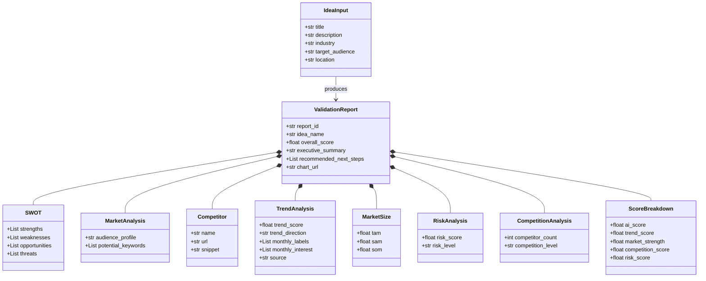
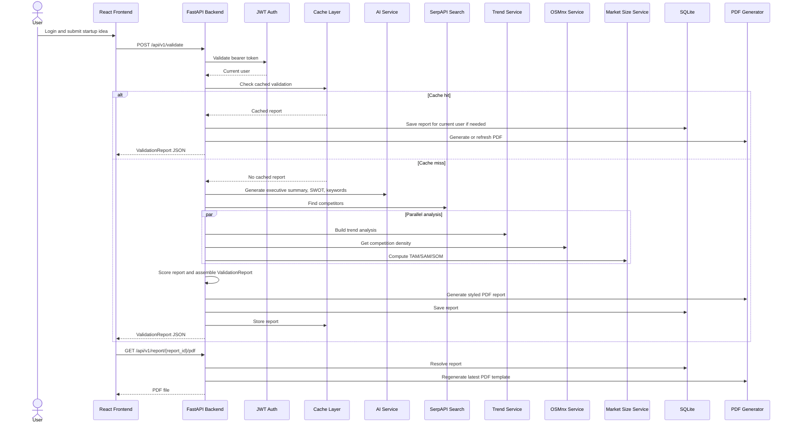

# TrendSpark AI

TrendSpark AI is a full-stack startup validation platform built with FastAPI and React. It lets a user log in, submit a startup idea, generate an AI-backed validation report, review saved reports in a dashboard, inspect analytics, and export a styled PDF report that mirrors the frontend layout.

## What the Project Does

- Validates startup ideas with AI-generated executive summary, SWOT analysis, market analysis, and next steps
- Calculates demand, market size, competition, and risk scores
- Shows a dashboard with trend, competition, risk, TAM/SAM/SOM, SWOT, and competitor cards
- Saves reports per user in SQLite
- Supports report preview, analytics, delete, and PDF export
- Uses JWT authentication for register/login and protected routes

## Current Stack

### Backend

- Python
- FastAPI
- Uvicorn
- SQLAlchemy
- Pydantic
- SQLite
- ReportLab
- Matplotlib
- Pytrends
- OSMnx
- SerpAPI
- Google GenAI SDK

### Frontend

- React 19
- Vite
- Axios
- React Router
- Chart.js
- React Chart.js 2
- ApexCharts
- Tailwind CSS

## Project Structure

```text
TrendSpark AI/
|-- Backend/
|   |-- app/
|   |   |-- auth/
|   |   |-- core/
|   |   |-- database/
|   |   |-- models/
|   |   |-- services/
|   |   `-- main.py
|   |-- reports/
|   |-- static/
|   |-- requirements.txt
|   `-- main.py
|-- trendspark-frontend/
|   |-- src/
|   |   |-- context/
|   |   |-- layout/
|   |   |-- pages/
|   |   `-- services/
|   |-- package.json
|   `-- vite.config.js
|-- .gitignore
|-- README.md
`-- to_run_server.txt
```

## Main Backend Routes

- `POST /api/v1/auth/register`
- `POST /api/v1/auth/login`
- `GET /api/v1/health`
- `POST /api/v1/validate`
- `GET /api/v1/reports`
- `GET /api/v1/report/{report_id}`
- `GET /api/v1/report/{report_id}/pdf`
- `DELETE /api/v1/report/{report_id}`

## Environment Variables

Create `Backend/.env` and add the keys you want to use:

```env
GOOGLE_API_KEY=your_google_api_key
OPENROUTER_API_KEY=your_openrouter_api_key
SERPAPI_KEY=your_serpapi_key
```

Notes:

- `GOOGLE_API_KEY` is used for Gemini-based AI generation
- `OPENROUTER_API_KEY` is used as a fallback AI provider
- `SERPAPI_KEY` is used for competitor search
- If some keys are missing, the app still runs with limited or fallback behavior

## Local Setup

### 1. Clone the repository

```powershell
git clone https://github.com/harikrishnan-152005/Trendspark.git
cd "TrendSpark AI"
```

### 2. Backend setup

```powershell
cd Backend
py -3 -m venv venv
venv\Scripts\activate
py -3 -m pip install -r requirements.txt
py -3 -m uvicorn app.main:app --reload --port 8000
```

Backend runs at:

```text
http://127.0.0.1:8000
```

### 3. Frontend setup

Open a second terminal:

```powershell
cd "E:\project phase 2\TrendSpark AI\trendspark-frontend"
npm install
npm run dev
```

Frontend runs at:

```text
http://127.0.0.1:5173
```

## Example Validate Request

```json
{
  "title": "MediPredict AI",
  "description": "An AI-based preventive health monitoring platform that uses wearable data to detect early disease risk.",
  "industry": "Health",
  "target_audience": "Urban working professionals and preventive care users",
  "location": "Chennai, India"
}
```

## Output Samples

### Sample API Response

```json
{
  "report_id": "550e8400-e29b-41d4-a716-446655440000",
  "idea_name": "MediPredict AI",
  "overall_score": 7.4,
  "executive_summary": "AI-assisted preventive healthcare concept with good demand indicators, moderate market pressure, and a clear pilot path.",
  "trend_analysis": {
    "trend_score": 62.0,
    "trend_direction": "Moderate demand",
    "monthly_labels": ["Jan", "Feb", "Mar", "Apr", "May", "Jun", "Jul", "Aug", "Sep", "Oct", "Nov", "Dec"],
    "monthly_interest": [52, 55, 54, 58, 60, 62, 64, 63, 66, 68, 70, 72],
    "source": "google_trends"
  },
  "market_size": {
    "tam": 125000000.0,
    "sam": 37500000.0,
    "som": 3750000.0
  },
  "risk_analysis": {
    "risk_score": 4.8,
    "risk_level": "Medium Risk"
  },
  "competition_analysis": {
    "competitor_count": 84,
    "competition_level": "Medium"
  },
  "swot_analysis": {
    "strengths": [
      "Clear preventive health value proposition",
      "Recurring engagement through continuous monitoring",
      "Scalable AI-driven insights",
      "Strong relevance for chronic care users",
      "Potential for insurer or hospital partnerships"
    ],
    "weaknesses": [
      "Needs trust and clinical validation",
      "Hardware integrations add complexity",
      "Data privacy expectations are high"
    ],
    "opportunities": [
      "Growing wearable adoption",
      "Preventive care focus is increasing",
      "Remote monitoring budgets are expanding"
    ],
    "threats": [
      "Large health platforms can copy features",
      "Regulatory scrutiny may increase",
      "Clinical buyers often have long sales cycles"
    ]
  },
  "recommended_next_steps": [
    "Pilot with one wearable integration first",
    "Validate alert usefulness with 15 target users",
    "Define clinical and non-clinical positioning boundaries"
  ]
}
```

### Sample Dashboard Sections

```text
Validation Snapshot
- Overall Score: 7.4 / 10
- Trend Direction: Moderate demand
- Competition Level: Medium
- Risk Level: Medium Risk
- Top Competitors: 5

Market Trend
- 12-month demand chart
- Peak month, lowest month, average, and momentum cards
- Monthly value tiles for Jan to Dec

Competition Snapshot
- Ranked competitor visibility chart
- Market pressure summary
- Top competitor cards with snippet and link

Report Details
- TAM / SAM / SOM cards
- SWOT analysis cards
- Recommended next steps
- Exportable PDF report
```

## What a Report Includes

- Overall validation score
- Executive summary
- SWOT analysis
- Audience profile and keyword suggestions
- 12-month market trend section
- Competition snapshot and competitor list
- Risk level and score breakdown
- TAM, SAM, and SOM
- Recommended next steps
- Styled PDF export

## Class Diagram



## Sequence Diagram



## Author

Harikrishnan Ambethkar

Machine Learning Enthusiast | Full Stack Developer
